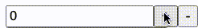

# 스핀박스 만들기

<p align="middle" >



</p>

- JavaScript로 구현하는 스핀박스 프로그램

## 실행하기

- 개발 모드

  ```
    npm run dev
  ```

- 빌드

  ```
    npm run build
  ```

## 구현 사항

- [x] 여러 개의 스핀박스 렌더링 기능
- [x] +, - 누를 시 1씩 값이 움직임.
- [x] (심화) 버튼을 계속 누르면 빠르게 움직임
- [x] 값을 입력할 수 있는 칸

## 개선이 필요한 사항

- 증감 버튼을 연속 클릭 시 불규칙하게 값이 움직이는 현상

## 배포 링크

- []()
