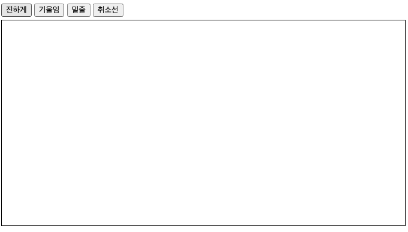

# 텍스트 에디터 만들기 scratch

<p align="middle" >



</p>

- JavaScript로 구현하는 텍스트 에디터 프로그램

## 실행하기

- 개발 모드

  ```
    npm run dev
  ```

- 빌드

  ```
    npm run build
  ```

## 구현 사항

- [x] 텍스트 입력 처리
- [x] 툴바 클릭 시 강조 표시

## 개선이 필요한 사항

- 연속적인 강조 표시 클릭 시 중첩 태그 발생

## 배포 링크

- []()
