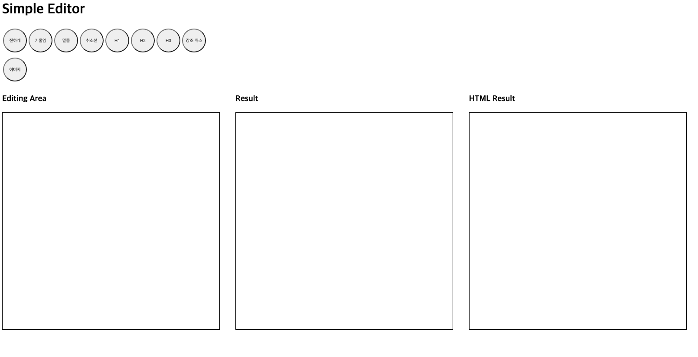

# 텍스트 에디터 만들기 scratch

<p align="middle" >



</p>

- React로 구현하는 텍스트 에디터 프로그램

## 실행하기

- 개발 모드

  ```
    npm run dev
  ```

- 빌드

  ```
    npm run build
  ```

## 구현 사항

- [x] 텍스트 입력 처리
- [x] 툴바 클릭 시 강조 표시
- [x] 적용된 강조 효과 감지

## 개선된 사항

- 다양한 커맨드에 유연하게 대응 가능한 구조

## 개선이 필요한 사항

- `document.execCommand()` 등, deprecated 기능 사용하지 않기

## 배포 링크

- [링크](https://kkan9ma.github.io/PBL/past-missions/editor/lv2-2/dist/)
