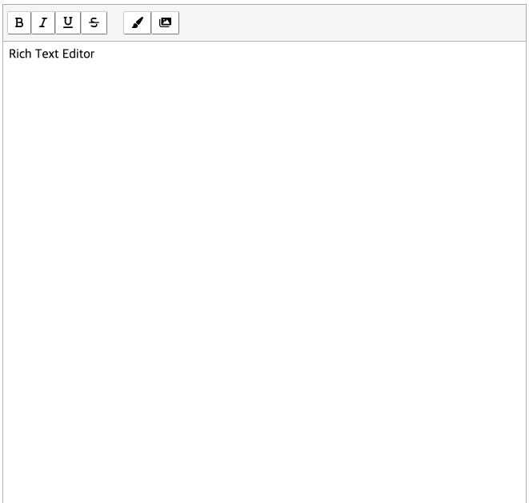

# 텍스트 에디터 만들기

<p align="middle" >



</p>

- Vanilla JS / React로 구현하는 텍스트 에디터 프로그램

## 실행하기

- 개발 모드

  ```
    React: cd react && npm run dev
    Vanilla: cd vanilla && npm run dev
  ```

- 빌드

  ```
    react: cd react && npm run build
    vanilla: cd vanilla && npm run build
  ```

## 구현 사항

- [x] 텍스트 입력 처리
- [x] 툴바 클릭 시 강조 표시
- [x] 적용된 강조 효과 감지

## 개선된 사항

- `document.execCommand()` 등, deprecated 기능 사용하지 않기

## 개선이 필요한 사항

- 반복된 이벤트 발생 시 에러 발생
- 이벤트 처리 구조

## 배포 링크

- [React]()
- [Vanilla]()
