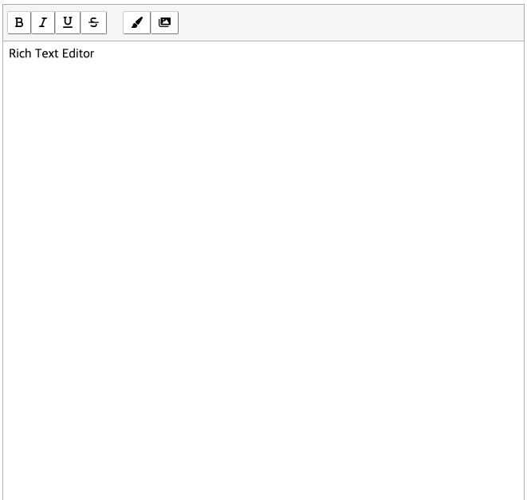
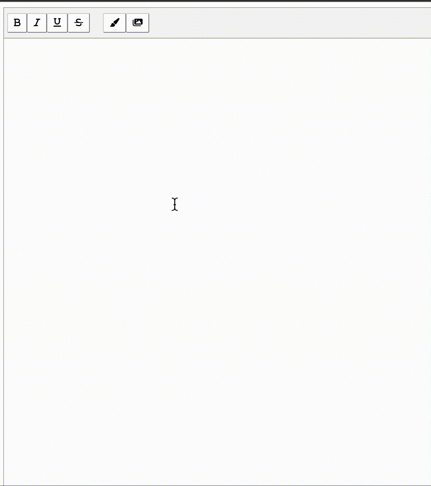
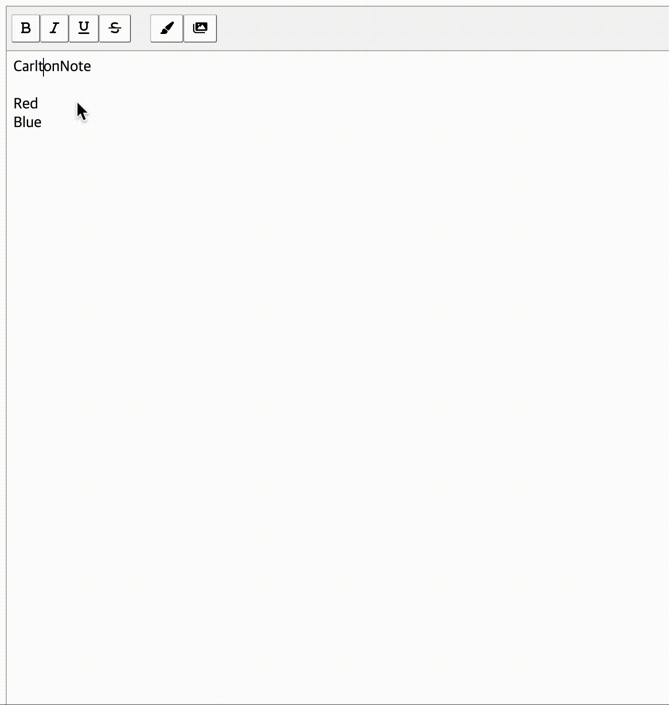

# CarltonNote (Rich Text Editor)

## 소개
<p align="middle" >



</p>

- Vanilla JS / React로 구현하는 텍스트 에디터 프로그램
- 밑바닥부터 직접 구현한 텍스트 WYSIWYG 에디터
- Bold(진하게), Italic(기울임), Underline(밑줄), Strike(취소선), 글씨 색상, 이미지 삽입, 단축키 기능 구현

## [Demo](https://kkan9ma.github.io/PBL/past-missions/editor/lv3-1-1st/react/dist/)

### 텍스트 입력 기능


### 주요 강조 효과: Bold, Italic, Underline, Strike (툴바, 단축키)


### 글씨 색상


### 이미지 삽입


---

### 개발 관련 주요 내용
- Bold(진하게), Italic(기울임), Underline(밑줄), Strike(취소선), 글씨 색상, 이미지 삽입, 단축키 기능 구현
- DOM 조작을 위해 외부 Library 사용 없이 Selection API, Range API만으로 구현
- 여러 줄 선택 영역에 대한 강조 효과 적용/해제 기능 구현
  - 여러 줄 선택 상태에서 range.surroundContents() 사용 시 발생한 non-text node 포함 에러 대응
- 사용자가 선택한 영역(Selection)을 구분자를 기준으로 여러 개의 Range로 나누어 강조 효과 적용
- 에디터 강조 효과를 개발하기 위한 `document.execCommand()` 등, deprecated 내용 미사용

---

## 실행하기

  ```
    React: cd react && npm run dev
    Vanilla: cd vanilla && npm run dev
  ```